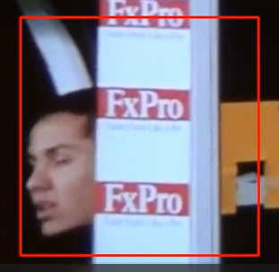
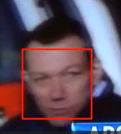

# Parte prática da prova 2 do módulo 6 de Engenharia de Computação

## Enunciado

Desenvolva um código em Python capaz de utilizar o openCV para a leitura de um vídeo (frame a frame) e, para cada frame, o seu código deve identificar e marcar na imagem os retângulos correspondentes a cada uma das faces encontradas. Ao final do código, um novo vídeo deve ser salvo com a(s) face(s) identificada(s).

Para a detecção das faces, pode-se utilizar a abordagem que quiser (haar cascade, filtro de correlação, YOLO). Não há a necessidade de fazer o fine tuning da detecção. Se o código é capaz de identificar faces corretamente na maior parte do tempo, considera-se como uma aplicação aceitável para esta etapa da prova.

Boa prova =)

## Exemplos

Este repositório conta com dois exemplos, ambos na pasta de exemplos:

1. `reproduz_video.py` -> exemplo de leitura e reprodução de vídeo utilizando o opencv; e
2. `edita_video.py` -> exemplo onde é possível ver como se abre um vídeo com o opencv e edita-o frame a frame, salvando um único arquivo de vídeo ao final.

# Explicação do funcionamento

1. Importação da biblioteca opencv.
2. Acesso aos classificadores em cascata para podermos usar o Haar Cascade para identificarmos rostos (mesmo que tenha identificado mais ou menos).
3. Uso do método Video Capture para abrir o vídeo.
4. Verifica se o vídeo foi aberto, caso não, avisa no terminal.
5. Utilizando as medidas do vídeo que foi aberto, definimos as medidas que o nosso vídeo de saída terá.
6. Criamos o nosso vídeo de saída na variável de output, as medidas que foram definidas no passo anterior, seu caminho e FPS.
7. Um loop para que os passos a seguir sejam feitos em cada frame do vídeo.
8. Enquanto ele ler os frames, ret será verdadeiro, mas quando ele se tornar falso, quebramos o loop.
9. Como estamos usando Haar Cascade e o exemplo dado em aula transforma nossa imagem em escalas de cinza, acredito que o funcionamento do filtro deve ser mais eficiente de tal forma, então, dentro da variável gray_frame guardamos o frame atual em tons de cinza.
10. Em faces, usamos o detector por meio do método multi scale, onde a imagem é diminuída a cada passada e, depois, o classificador é testado.
11. Nós selecionamos os dados pegos do retângulo que é feito no rosto detectado.
12. E a partir dos dados, desenhamos esse retângulo no frame sem a escala de cinza.
13. Em uma janela, abrimos os frames que estamos exibindo.
14. E escrevemos os frames na nossa variável de vídeo de saída.
15. Definimos a letra q para quebrarmos o loop antes do vídeo acabar, se quisermos.
16. Depois que o look é quebrado quando o vídeo acaba, a janela é fechada.

Infelizmente, aconteceu de não ter tempo o suficiente para ajustar o vídeo da forma que o Haar Cascade funcione com sua melhor performance no vídeo de input, então, aconteceu de ele detectar várias outras coisas no lugar do rosto, mas, a seguir, estão os momentos que isso acorreu (baby steps):

